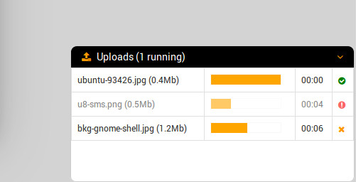

# ng-upload-window

A wrapper around the [ng-file-upload](https://github.com/danialfarid/ng-file-upload) directive which interacts wiith the upload service
in order to have the uploaded files shown in a layer window like google drive uploads. The `then` function of the returned object is
decorated in order to manage different information and wrap the callbacks `success`, `error` and `progress`



## Features

- uploads shown in a position fixed window placed in the bottom right of the viewport
- upload window can be iconized
- upload window can be closed there isn't any running upload
- progress bar and remaining time
- current running uploads

## Requirements
- [ng-file-upload](https://github.com/danialfarid/ng-file-upload)
- [FontAwesome](http://fortawesome.github.io/Font-Awesome/)

## Usage

1. install the requirements

2. include the ng-upload-window js and css in your document

    ```html
    <script src="ng-upload-window.js"></script>
    <link type="text/css" rel="stylesheet" href="ng-upload-window.css" />
    ```

3. include ngUploadWindow as a dependency in your application module:

    ```javascript
    var app = angular.module('myApp', ['ngUploadWindow']);
    ```
4. include the directive in your base template

    ```html
    <upload-window></upload-window>
    ```

4. inject UploadWindow provider in your service

    ```javascript
    angular
        .module('myApp.services', [])
        .factory('myService', myService);

    myService.$inject = ['UploadWindow'];

    function myService(UploadWindow) {

        var service = {
            uploadAttachment: uploadAttachment
        };

        return service;

        /////////////////////

        function uploadAttachment(file) {
            return UploadWindow.upload({
                url: '/my-add-attachment-api-url/',
                method: 'POST',
                file: file,
                fileFormDataName: 'file'
            });
        }
    }
    ```

## License

[MIT License](https://opensource.org/licenses/MIT)

## Maintainers

- abidibo (abidibo@gmail.com)
